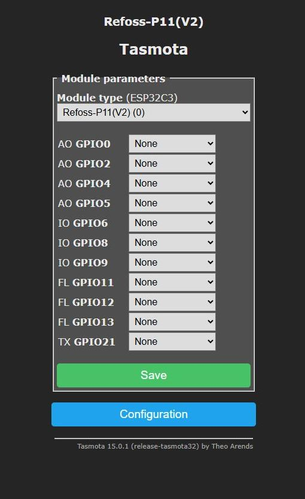
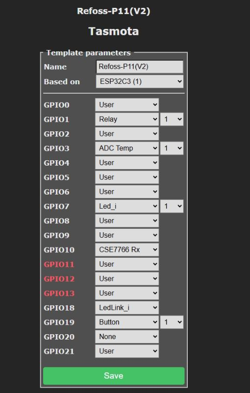

# Tasmota Template for Refoss P11 V2
Tasmota Template for Refoss P11 V2

The Tasmota Refoss P11 V2 introduces several key differences compared to the original Refoss P11. Most notably, all GPIOs have been reassigned. Additionally, new parameters, module configurations, and template settings have been added, along with brand-new Matter and KNX integration options accessible directly from the main menu. 

Tasmota Refoss P11 V2 Template Settings:

````
{"NAME":"Refoss-P11(V2)","GPIO":[1,224,1,4736,1,1,1,320,1,1,3104,1,1,1,1,1,0,1,576,32,0,1],"FLAG":0,"BASE":1}
````

</BR>
Refoss P11 V2 Configuration Settings
</BR>

Tasmota ||
--- | --- |
Tasmota Refoss P11 V2 Template GPIO assignments | Tasmota Refoss P11 V2 Parameters |
 |  |

</BR>

Tasmota Refoss P11 V2 Specifications:

Refoss P11 V2 Supported Protocols
--- |
Tasmota
MQTT
ESP8266
Internal Temperature
Energy Monitor
Matter
KNX|


Pin | | |
--- | --- | ---
GPIO1	| Relay | 1
GPIO3	| ADC Temp | 1 
GPIO7	| Led_i | 1
GPIO10	| CSE7766 Rx	|
GPIO18	| LedLink_i	| 
GPIO19	| Button | 1

</BR>

  

